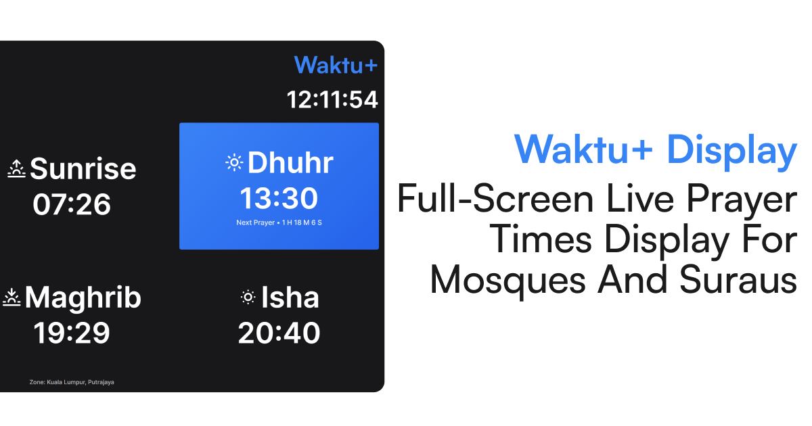

# Waktu+ - Prayer Times Display

**Waktu+** is a free full-screen prayer times display for mosques and suraus in Malaysia. It is designed for TVs, monitors, and browsers where clear, always-on prayer information matters.

Free to use. No ads. No signup.

**Website:** [waktu.shahrulestar.com](https://waktu.shahrulestar.com)

## About

Waktu+ shows today's prayer times in a full-screen display layout using JAKIM (Jabatan Kemajuan Islam Malaysia) data, built for distance viewing in masjids and suraus. The display stays readable at a glance: large clock, prayer schedule, next-prayer countdown, and optional alerts for azan, iqamah, and Friday khutbah.

The display is bilingual (English and Bahasa Malaysia) and supports all Malaysian prayer zones.

## Features

### Prayer times display
- Real-time clock synced to server time (Asia/Kuala_Lumpur)
- Today's six prayer times: Subuh, Syuruk, Zohor/Jumaah, Asar, Maghrib, Isyak
- Countdown to the next prayer
- Hijri and Gregorian dates (Hijri date switches at Maghrib)

### Mosque & surau alerts
- Azan countdown overlay
- Azan-now overlay
- Iqamah countdown (configurable)
- Friday/Jumaah khutbah countdown
- Sunrise (Syuruk) countdown
- Optional azan audio

### Display settings
- Prayer zone selection (all Malaysian zones)
- GPS-based zone detection
- Custom display title
- Theme color
- 12-hour or 24-hour time format
- Toggle header and zone label
- Enable or disable individual alert types
- Fullscreen mode (remembered in the browser)
- Auto-refresh (hourly reload)
- Test alert modes for setup and troubleshooting

### Built for screens
- Full-screen layout scaled from a 1920×1080 design
- Works on desktop browsers, TVs, and large monitors
- Progressive Web App (PWA) support for kiosk-style use
- Mobile warning when opened on small screens

## Localization

- **English** and **Bahasa Malaysia**
- Localized prayer names, UI labels, and date formatting

## Contact

Questions, feedback, or bug reports:

- **Email:** [hello@shahrulestar.com](mailto:hello@shahrulestar.com)
- **Threads:** [@shahrulestar](https://www.threads.com/@shahrulestar)

For security vulnerabilities, see the [Security policy](SECURITY.md).

## Community

- [Contributing](CONTRIBUTING.md)
- [Code of Conduct](CODE_OF_CONDUCT.md)
- [Security policy](SECURITY.md)

## License

This project is licensed under the [MIT License](LICENSE).
